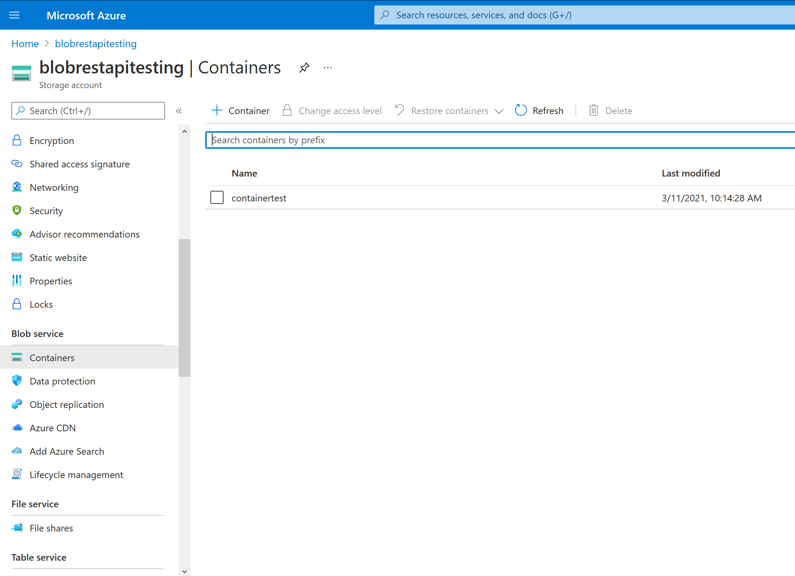
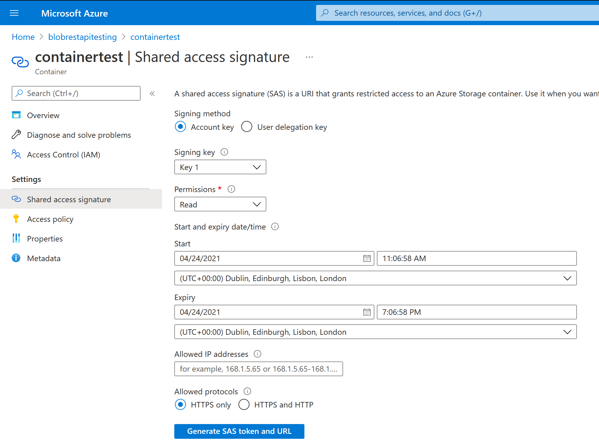

## Azure Blob Storage Channel

### Usage

This channel uses Azure Blob Storage (Microsoft Azure's cloud file storage service) to communicate messages back and forth between the C3 gateway and the Relay. To use this channel, you'll need to provide C3 with three parameters:

* The Azure Storage Account name
* The name of a container within the provided storage account
* A Shared Access Signature (SAS) token for the container with full Read/Add/Create/Write/Delete/List access

To create an Azure Storage Account, open the [Azure Portal](https://portal.azure.com/) and search for 'Create a storage account' within 'Create a resource'. Here, you will select the name of the storage account, which will be used later for the C3 channel.

Once the storage account has been created, you will need to create a container within the account. These can created by navigating to your storage account and navigating to 'Containers' under 'Blob service' in the left-hand sidebar. The name of this container is the second parameter required to start a channel. Once you have created a container, it will be shown in this page as in the screenshot below.

Finally, you must create a Shared Access Signature (SAS) token associated with the container, not the storage account as a whole. This token will grant the C3 channel access to the container to perform its function. To create the Shared Access Signature, click on your container and navigate to 'Shared access signature' within 'Settings' on the left-hand sidebar. You should be greeted with the page below.

It is important that the SAS token is configured correctly so that the C3 channel can communicate effectively for the duration you need it. Under 'Permissions', ensure that all six options are ticked (Read, Add, Create, Write, Delete, List). Then ensure that the Start and Expiry dates and times are appropriate for your use case. Ensure that you click 'Generate SAS token and URL' after setting these parameters as the token will not auto-update if you change one after generation. The contents of the 'Blob SAS token' are what you need to provide the C3 channel.

With these three parameters, you can create the Azure Blob Storage channel in the C3 web interface. C3 will create folders within your container to use as separate channels.