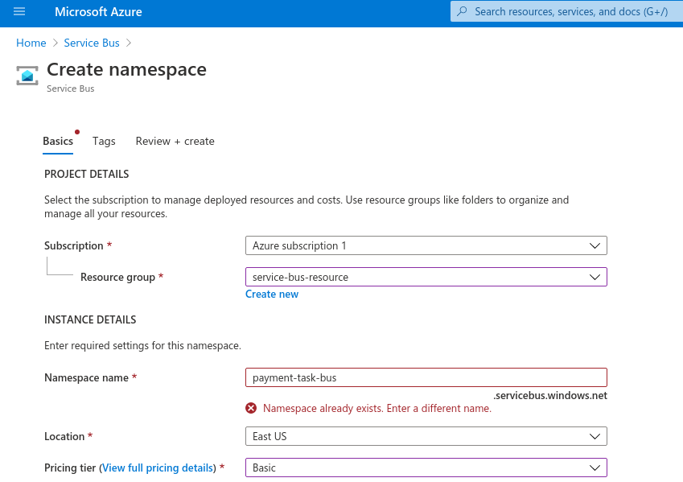
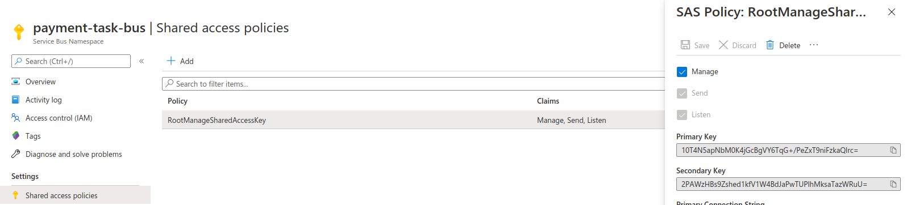
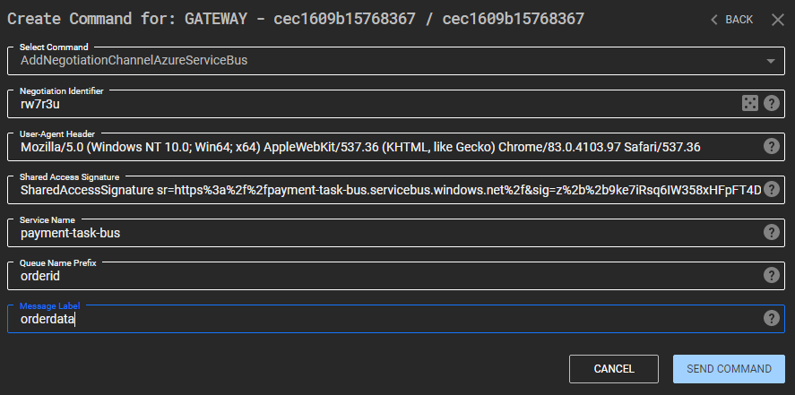
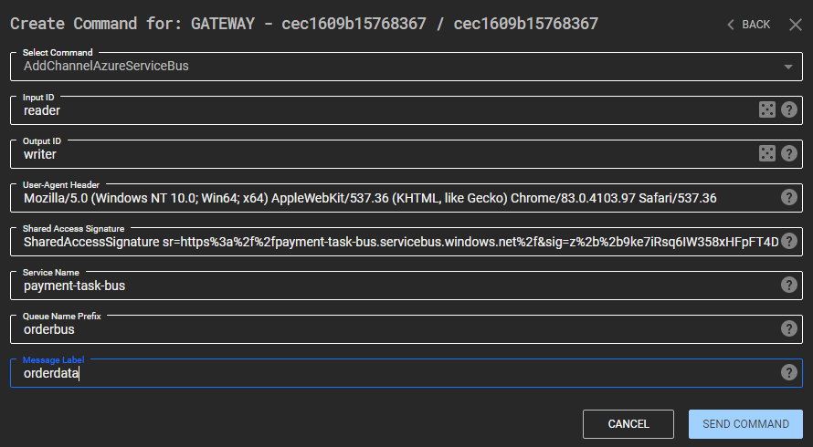
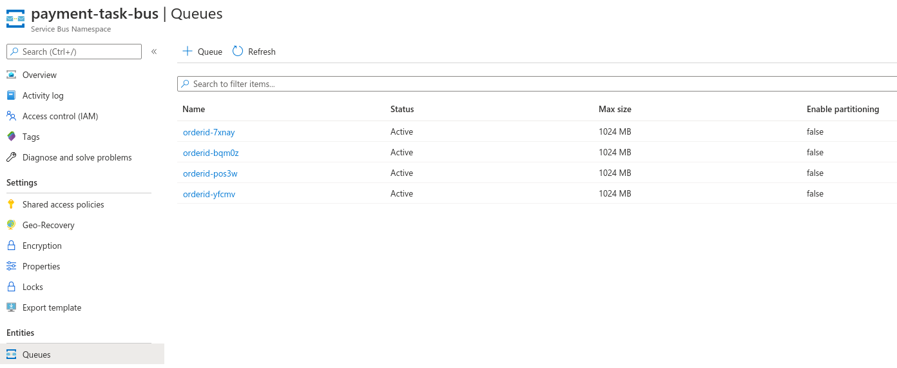
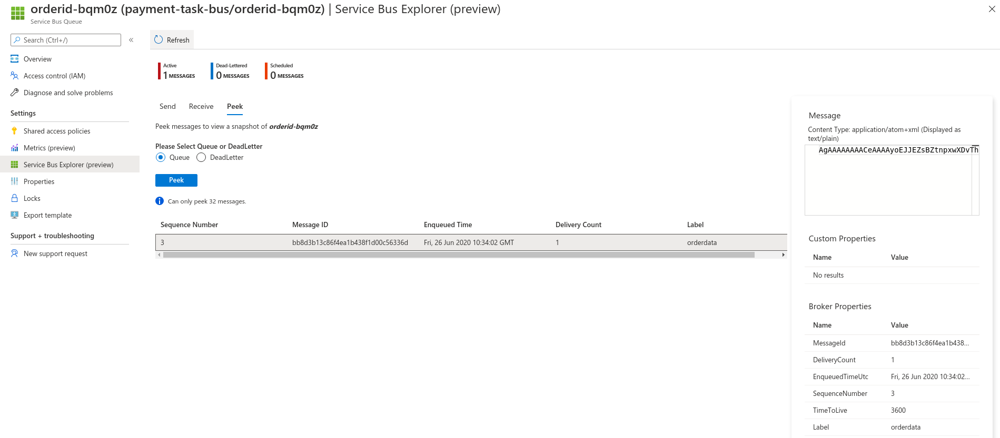

## Azure Service Bus Channel Guide

### Setup

* This channel requires an active subscription, "Azure Subscription Level 1" works.

* Within the Azure Portal go to Home -> Service Bus -> Add, fill in the options as shown below. Note that the namespace name option will form the endpoint communication will occur over, so use something legitimate looking.

* Once created, go back to the service bus home page and click on the newly created namespace.

* Go to the Shared Access Policies page, click on the RootManageSharedAccessKey and copy the Primary Key Value.

* Use the key value to generate a signature, it is advised to use the project at https://git.f-secure.com/tim.carrington/azureservicebussignaturegenerator as follows:

`servicebus.exe payment-task-bus RootManageSharedAccessKey 10T4N5apNbM0K4jGcBgVY6TqG+/PeZxT9niFzkaQlrc=`

* Where payment-task-bus is the namespace name chosen earlier.

* The output should look as such:

`SharedAccessSignature sr=https%3a%2f%2fpayment-task-bus.servicebus.windows.net%2f&sig=v3wb1SBjw7JVWamM864dzN%2fa2wHTO7%2f%2byp0O1eYbzV8%3d&se=3186322988&skn=RootManageSharedAccessKey`

### Usage

* This channel provides the following options required on creation:

1. InputId and OutputId - these will be used to create a pair of read/write queues within the namespace. Note that the queue name forms part of the URL when reading and writing.

2. User Agent Header - used to add a user agent header to requests.

3. Shared Access Signature - this is required to authenticate to the service bus as previously described.

4. Service Name - the namespace name chosen earlier, in this example we would use payment-task-bus.

5. Queue Name Prefix - this is a static prefix that will be prepended to any queue. So if InputId is set to "ansj773", and prefix is set to "orderid", the input queue name will be "orderid-ansj773".

6. Message Label - messages to the queue require a BrokerProperties header containing JSON data. One key/value is the Label, set this to something legitimate looking, in this example "orderdata" would make sense.

* Below is examples of a negotiation and single channel creation in C3's UI:

### Opsec

* Messages have a hardcoded Time-to-live of 2days, if the message isn't read within that time it will automatically be deleted by Azure. You can run the SetTimeToLive command on the channel interface to alter the Time To Live.

* The following image shows queues that have been setup after a relay has been executed over a negotiation channel:

* This image shows the data available within Azure:

