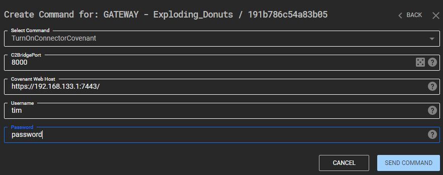
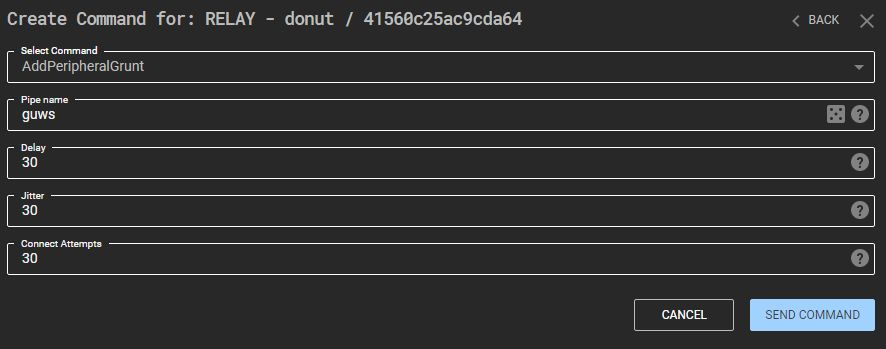

This section demonstrates how to use the new integration of the Covenant C2 framework. The process is described below.

A 1-line modification is required to the Covenant C2 source code to allow integration:

```
diff --git a/Covenant/Models/Launchers/ShellCodeLauncher.cs b/Covenant/Models/Launchers/ShellCodeLauncher.cs
index 14c395b..4771da2 100644
--- a/Covenant/Models/Launchers/ShellCodeLauncher.cs
+++ b/Covenant/Models/Launchers/ShellCodeLauncher.cs
@@ -47,7 +47,7 @@ namespace Covenant.Models.Launchers
             if (ret == Constants.DONUT_ERROR_SUCCESS)
             {
                 this.Base64ILByteString = Convert.ToBase64String(File.ReadAllBytes(outputf));
-                this.LauncherString = template.Name + ".bin";
+                this.LauncherString = Convert.ToBase64String(File.ReadAllBytes(outputf)); //template.Name + ".bin";
             }
             return this.LauncherString;
         }
```

1. Select a running gateway, open its command centre and select TurnOnConnectorCovenant.

2. Fill in the form, these options will be used to create a BridgeListener in Covenant on the specified port.



3. In order to stage an SMB Grunt, select a running Node Relay’s command centre and select AddPeripheralGrunt. 




